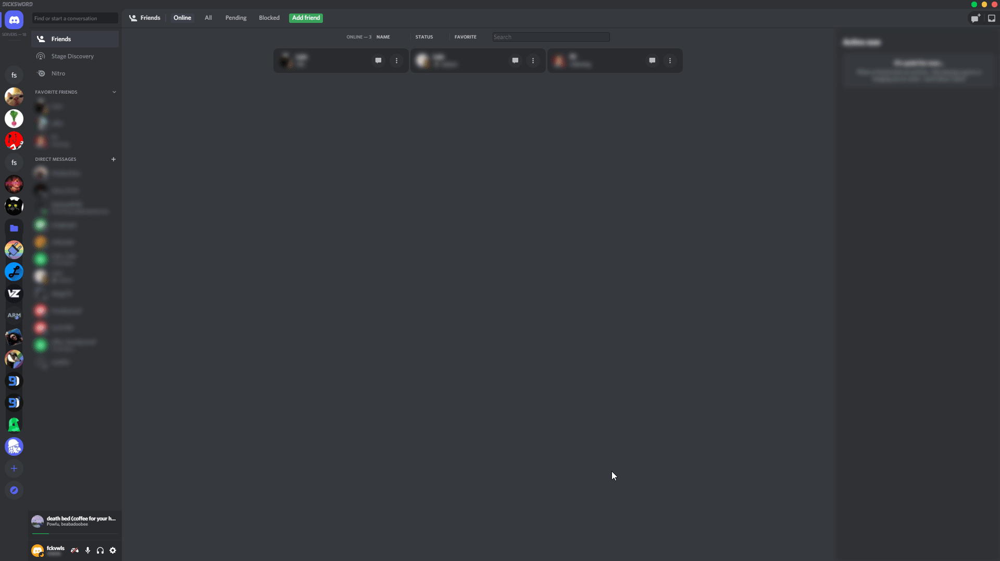
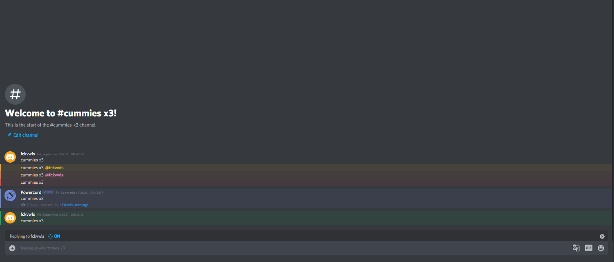
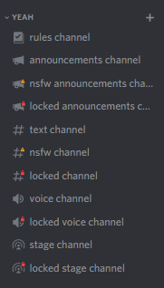

QuickSCSS [](https://www.codefactor.io/repository/github/wathhr/quickscss/overview/dev)
===

> ⚠ This branch is still a huge work-in-progress, a lot of things might be unfinished and/or broken.

A customizable Discord theme, mainly for [PowerCord](https://github.com/powercord-org/powercord).

QuickSCSS tries to work alongside other themes, while still looking nice with Discord's base design.

<sup>*This theme is intended to be used with the English UK locale, using a different locale might cause some issues.*</sup>

<details><summary>Screenshots</summary><br>









</details>

<br>

<details><summary>I suggest using the extension named "Better comments"/"Colored comments"</summary>

- [VSCode](https://marketplace.visualstudio.com/items?itemName=aaron-bond.better-comments)

- [Sublime text](https://packagecontrol.io/packages/Colored%20Comments)

- [Atom](https://github.com/AndrewKralovec/atom-better-comments)

<sub>_If your text editor is not listed, the extension probably has not been ported over to it_</sub>

</details>

## Credits
- Powercord's terrible Quick CSS.
  - Pretty much the only reason I made this is because of how bad powerCord's Quick CSS is.
  - It randomly wipes itself after Discord crashes.
  - No SCSS support.

- [Hyblocker](https://github.com/hyblocker)
  - I Stole their [Space channels "snippet"](https://github.com/hyblocker/pixelcord/blob/59856ce1a9f7c59634101d5991f38c6e091a6063/src/app/qol/_space_channels.scss).
  - And probably a lot of other random stuff I forgot about.

- [NYRI4](https://github.com/NYRI4) & [Snapperito](https://github.com/Snapperito)
  - I stole their [Discolored theme](https://github.com/NYRI4/Discolored).

- [ClearVision team](https://github.com/ClearVision)
  - I stole their [Settings icons "snippet"](https://github.com/ClearVision/ClearVision-v6/blob/master/src/settings/icons.scss) idea.

- [Daniel Klingel](https://github.com/CorellanStoma)
  - I stole their [Context menu icons theme](https://github.com/CorellanStoma/Menu-Icons) idea.

## [Building](./BUILDING.md)

## Licensing
```
    This program is free software: you can redistribute it and/or modify
    it under the terms of the GNU General Public License as published by
    the Free Software Foundation, either version 3 of the License, or
    (at your option) any later version.

    This program is distributed in the hope that it will be useful,
    but WITHOUT ANY WARRANTY; without even the implied warranty of
    MERCHANTABILITY or FITNESS FOR A PARTICULAR PURPOSE.  See the
    GNU General Public License for more details.

    You should have received a copy of the GNU General Public License
    along with this program.  If not, see <https://www.gnu.org/licenses/>.
```
Copyright &copy; 2020-2022 wathhr
