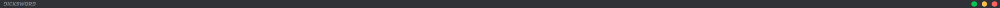
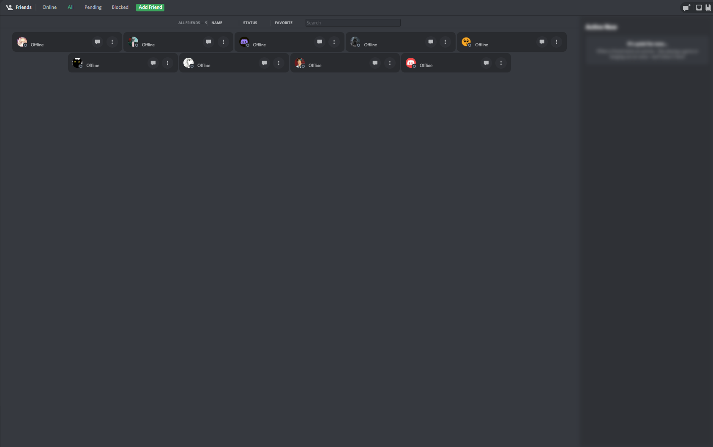
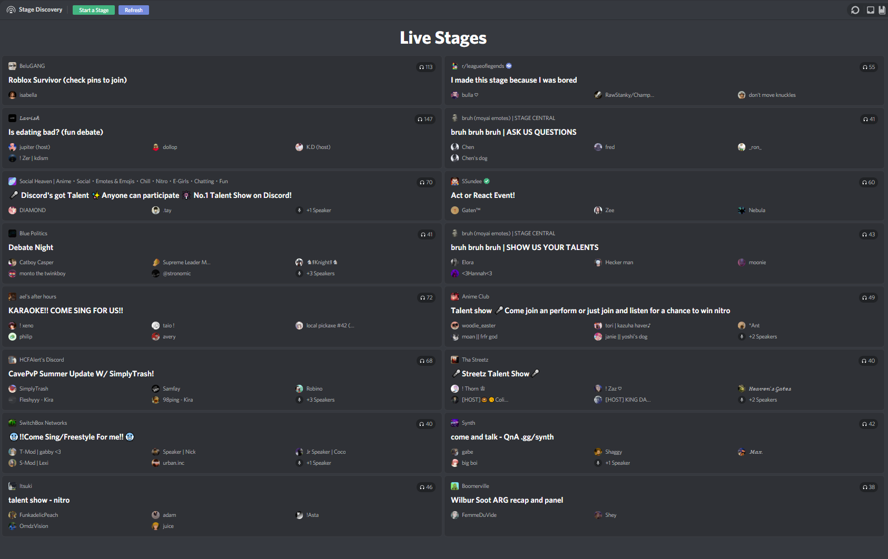
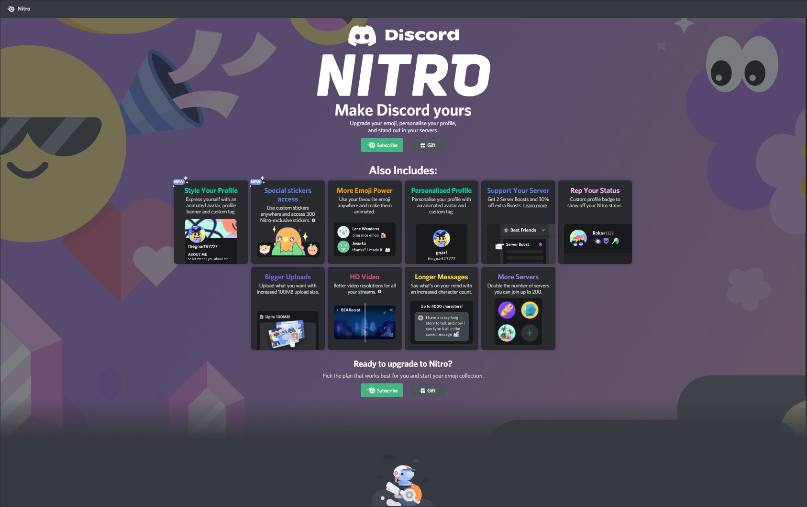
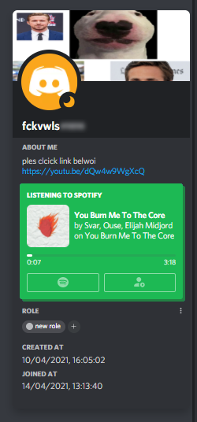
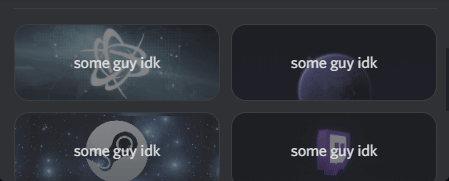

# QuickSCSS 

cool customizable theme or something idk just look at the screenshots below; i don't have to write a 5000 word essay to make you want to use my theme

I suggest using the extension named "Better comments"/"Colored comments":
###### (**especially** if you are going to edit the actual code)

URLs
<!-- ZWS here -->

- [VSCode](https://marketplace.visualstudio.com/items?itemName=aaron-bond.better-comments)
- [Sublime text](https://packagecontrol.io/packages/Colored%20Comments)
- [Atom](https://github.com/AndrewKralovec/atom-better-comments)

###### If your text editor is not listed, the extension probably has not been ported over to it

Screenshots
<!-- ZWS here -->

Titlebar

Friend list

Stage Discovery tab

Nitro tab

User popout

Connection backgrounds

## Credits

- Powercord's terrible Quick CSS.
  - Pretty much the only reason i made this is because of how bad Powercord's Quick CSS "editor" is.
- [KraXen72](https://github.com/KraXen72)
  - I implemented an old and customized version of their [Harmony](https://github.com/KraXen72/harmony-discord/) theme into this theme.
- [Alfred](https://www.youtube.com/watch?v=NWD7iqtOJSE) ( Epic !! ))))
  - They told me to start using SCSS or something idk he's cool.
- [Ducko](https://github.com/CanadaHonk)
  - I stole the vars he used on his [GT-RevertRebrand](https://github.com/Goose-Nest/GT-RevertRebrand) theme.
- All the snippets I stole from random people lol
  - Some snippets on this theme were "stolen" from the [#css-snippets](https://canary.discord.com/channels/538759280057122817/755005803303403570/) channel on the Powercord server; I sadly do not remember which snippets are stolen and which aren't so I can give full credit.
                                                                       

